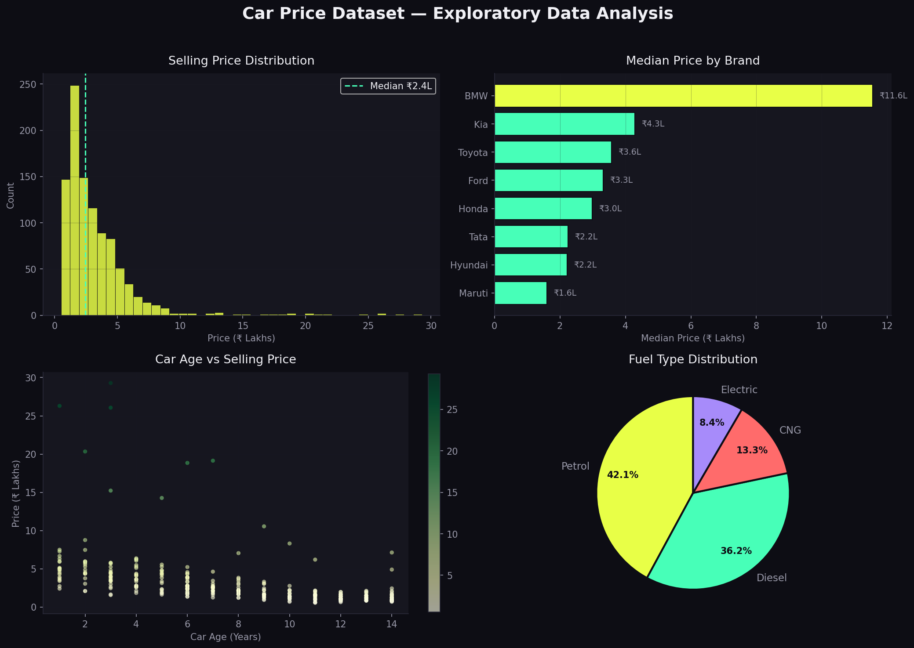
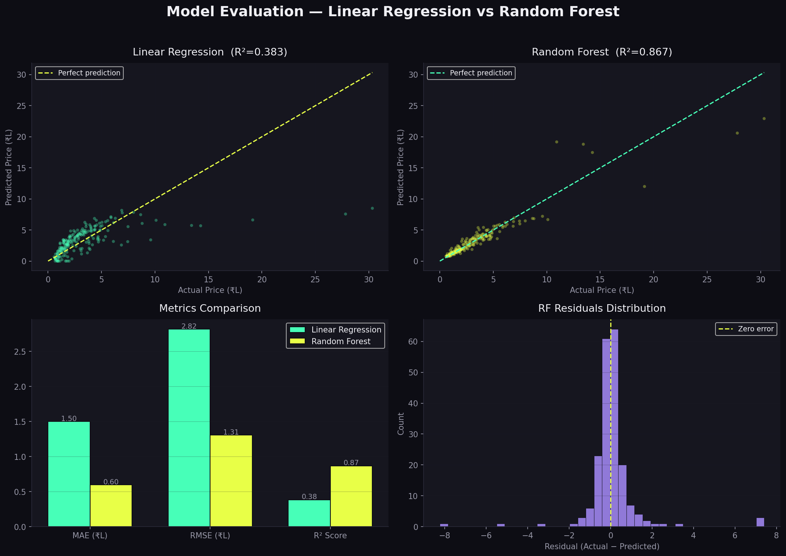
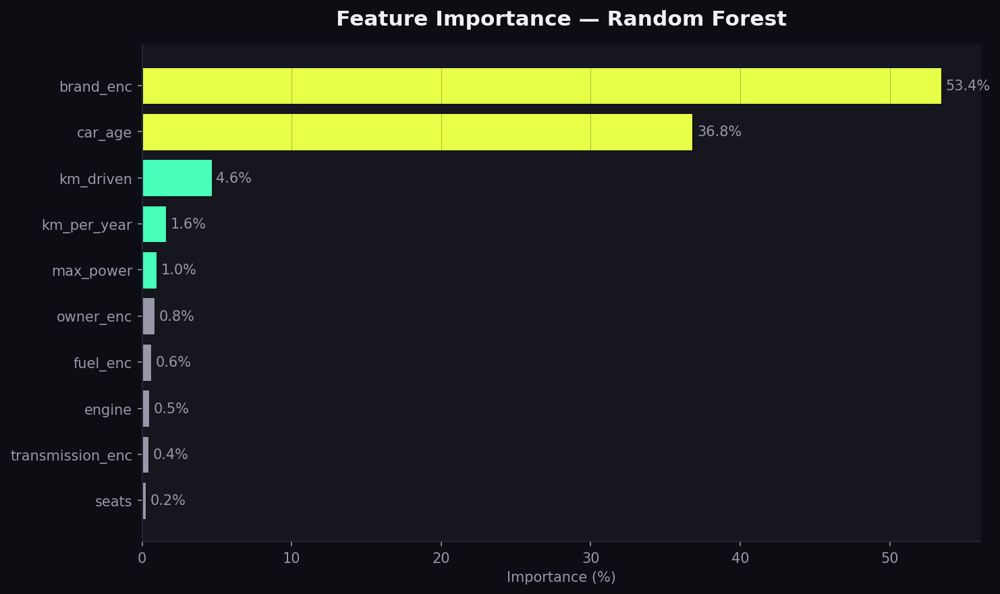

# 🚗 Car Price Prediction Model — ML Project

> Internpe Internship | Week 2 Project  
> Built a Machine Learning model to predict car selling prices — just like CarDekho & OLX!

---

## 📌 Problem Statement

When someone wants to sell or buy a used car, how do they know the right price?  
This ML model takes car details as input and predicts the estimated market price instantly.

---

## 📊 Dataset Features

| Feature | Description |
|--------|-------------|
| `brand` | Car manufacturer (Maruti, BMW, Hyundai...) |
| `year` | Year of manufacture |
| `km_driven` | Total kilometers driven |
| `fuel` | Fuel type (Petrol / Diesel / CNG / Electric) |
| `seller_type` | Individual / Dealer / Trustmark Dealer |
| `transmission` | Manual / Automatic |
| `owner` | First / Second / Third owner |
| `engine` | Engine capacity in CC |
| `max_power` | Maximum power in bhp |
| `seats` | Number of seats |
| `selling_price` | 🎯 Target variable (₹ Lakhs) |

---

## 🔧 Steps Followed

### Step 1 — Import Libraries
```python
import pandas as pd
import numpy as np
import matplotlib.pyplot as plt
from sklearn.ensemble import RandomForestRegressor
from sklearn.linear_model import LinearRegression
```

### Step 2 — Dataset Creation
- 1000 car records generated with realistic pricing logic
- Covers 8 brands, 4 fuel types, price range ₹0.5L to ₹40L+

### Step 3 — Data Cleaning & Preprocessing
- ✅ Filled missing values with **median** (resistant to outliers)
- ✅ Created new features: `car_age`, `km_per_year`
- ✅ **Label Encoding** for categorical columns (brand, fuel, owner...)
- ✅ **StandardScaler** to normalize all features

### Step 4 — Train / Test Split
- 80% Training data → 800 cars
- 20% Testing data → 200 cars

### Step 5 — Model Training
- Model 1: **Linear Regression** (simple baseline)
- Model 2: **Random Forest** (100 decision trees)

### Step 6 — Model Evaluation

| Metric | Linear Regression | Random Forest |
|--------|------------------|---------------|
| MAE | ₹1.50 Lakhs | ₹0.60 Lakhs |
| RMSE | ₹2.82 Lakhs | ₹1.31 Lakhs |
| R² Score | 38.3% | **86.7%** ✅ |

### Step 7 — Predictions on New Cars

| Car | Predicted Price |
|-----|----------------|
| 2021 BMW \| Petrol \| Automatic \| 20,000 km | ₹24.43 Lakhs |
| 2020 Maruti \| Petrol \| Manual \| 30,000 km | ₹3.43 Lakhs |
| 2019 Hyundai \| Diesel \| Manual \| 55,000 km | ₹4.20 Lakhs |
| 2014 Maruti \| CNG \| Manual \| 90,000 km | ₹0.85 Lakhs |

---

## 📈 Visualizations

### Plot 1 — Exploratory Data Analysis


### Plot 2 — Model Performance


### Plot 3 — Feature Importance


---

## 🔍 Key Insights

### Why Random Forest beats Linear Regression?
- Linear Regression draws ONE straight line — too simple for complex car pricing
- Random Forest uses **100 decision trees** and takes majority vote — much smarter!

### Feature Importance Results
```
Brand      → 53.4%  ← Most important factor!
Car Age    → 36.8%  ← Second most important
KM Driven  →  4.6%  ← Less than you'd expect
Max Power  →  1.0%
Owner Type →  0.8%
Fuel Type  →  0.6%
```

💡 **Key Learning:** What car you buy matters MORE than how much you drive it!

### Why Median over Mean for missing values?
```
Example: 3L, 4L, 5L, 4L, 95L (BMW outlier)
Mean   = 22.2L ❌ Distorted by outlier
Median =  4.0L ✅ Represents typical car correctly
```

---

## 🛠️ Tech Stack


- **Python 3.14**
- **Pandas** — Data manipulation
- **NumPy** — Numerical operations
- **Scikit-Learn** — ML models, preprocessing, evaluation
- **Matplotlib / Seaborn** — Visualizations

---

## 🚀 How to Run

**1. Clone the repository**
```bash
git clone https://github.com/YOUR_USERNAME/Car-Price-Prediction-ML.git
cd Car-Price-Prediction-ML
```

**2. Install dependencies**
```bash
pip install pandas numpy scikit-learn matplotlib seaborn
```

**3. Run the ML model**
```bash
py car_price_prediction.py
```

**4. Generate plots**
```bash
py generate_plots.py
```

---

## 📁 Project Structure

```
Car-Price-Prediction-ML/
│
├── car_price_prediction.py   ← Main ML model (all 7 steps)
├── generate_plots.py         ← Visualization script
├── model_data.pkl            ← Saved trained model
├── plot1_eda.png             ← EDA charts
├── plot2_model.png           ← Model evaluation charts
├── plot3_importance.png      ← Feature importance chart
└── README.md                 ← You are here!
```

---

## 🎯 What I Learned

- Why **data preprocessing** is critical before training any ML model
- Difference between **Linear Regression** and **Random Forest**
- How to handle **missing values**, **encoding**, and **scaling**
- How to evaluate models using **MAE**, **RMSE**, and **R²**
- How real-world apps like **CarDekho** and **OLX** estimate car prices

---

## 👩‍💻 Author

**Pallavi** — Internpe ML Internship | Week 2  
📌 Built with 💛 and lots of debugging!

---

*⭐ If you found this helpful, give it a star!*
